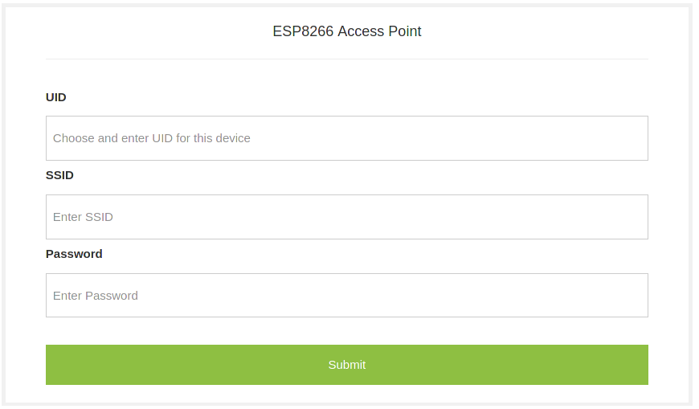

# esp8266 Acess Point

This project is meant to be used as part of
 [esp8266_WeatherStation](https://github.com/lopeztel/esp8266_WeatherStation)
 and [esp8266_NeoPixel](https://github.com/lopeztel/esp8266_NeoPixel)

## Access Point configuration through web page

The goal of this project is to provide a finished product experience and initial\
WiFi connection configuration of a esp8266 device.

Initially the device will have SSID _esp8266\_AP_ with password _esp8266\_AP_\
and configuration portal will be available at: `192.168.5.1/start.html`

* **UID** (Unique ID) is an identifier necessary to distinguish the device
 (important for MQTT)
* **SSID** is the name of the WiFi network the device will connect to
* **Password** corresponds to the access key to that network

## Demo

Once the **Submit** button is pressed the device will reset in station mode and automatically
 connect to the configured network (Just like a more finished product would)
